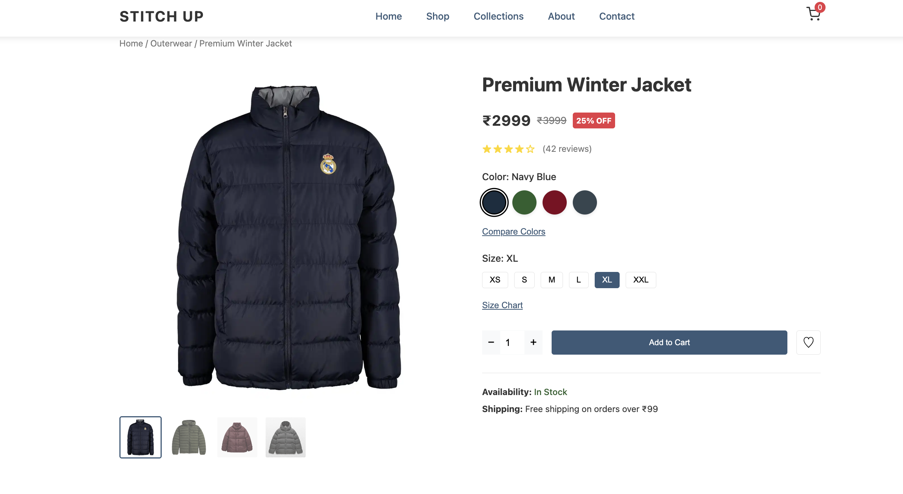
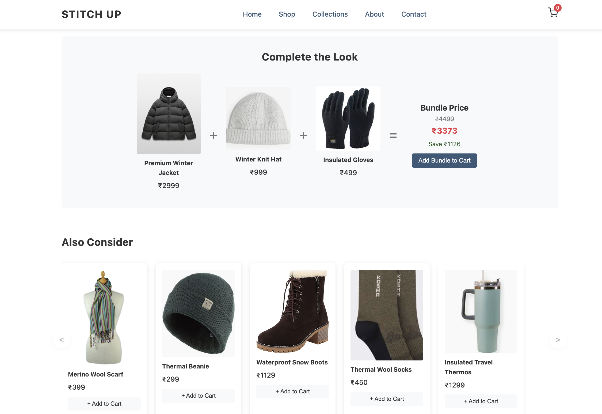

# StitchUp - Premium E-commerce Product Page



## 📋 Project Overview

StitchUp is a modern, feature-rich e-commerce product page designed to showcase premium clothing items. This project implements a comprehensive product detail page with multiple interactive features to enhance the shopping experience.

### 🌟 [Live Demo](https://kavyasinha.github.io/StitchUp-Product-Page/)



## ✨ Features

The product page includes numerous interactive elements and user-friendly features:

### Product Presentation
- **Dynamic Image Gallery** - Main product image with clickable thumbnails
- **Image Zoom** - Hover effect for detailed product viewing
- **Color Selection** - Interactive color swatches with visual feedback
- **Size Selection** - Size options with integrated size chart

### Enhanced Shopping Experience
- **Product Tabs** - Organized information in tabs (Description, Product Information, Shipping)
- **Product Bundle** - "Complete the Look" bundle with discount pricing
- **Complementary Products** - Scrollable carousel of related items
- **Product Recommendations** - "You May Also Like" section with similar products

### User Interaction
- **Quantity Selector** - Intuitive quantity adjustment controls
- **Add to Cart Functionality** - Cart management with visual feedback
- **Wishlist Integration** - Save products for later feature
- **Modal Windows** - For size charts and color comparisons

### Additional Features
- **Responsive Design** - Works on various screen sizes
- **Micro-interactions** - Subtle animations for better user feedback
- **Persistent Selections** - Remembers user's color and size choices
- **Notifications** - Elegant pop-up notifications for cart actions

## 🚀 Getting Started

### Prerequisites
- Modern web browser (Chrome, Firefox, Safari, Edge)

### Installation

1. Clone the repository:
```bash
git clone https://github.com/kavyasinha/StitchUp-Product-Page.git
```

2. Navigate to the project directory:
```bash
cd StitchUp-Product-Page
```

3. Open the HTML file in your browser:
```bash
open index.html  # On macOS
# OR
start index.html  # On Windows
```

## 🔧 Project Structure

```
stitchup-product-page/
├── index.html            # Main HTML structure
├── style.css             # CSS styles
├── script.js             # JavaScript functionality
└── assets/               # Images and other assets
    ├── image.png
    ├── image copy.png
    ├── image copy 2.png
    └── ...
```

## 🧩 Key Components

### HTML Structure
- **Header/Navigation** - Site navigation and cart
- **Product Gallery** - Main image and thumbnails
- **Product Details** - Title, price, variants, actions
- **Product Information** - Tabs with detailed information
- **Related Products** - Complementary and suggested items
- **Footer** - Site links and newsletter signup
- **Modals** - Size chart and color comparison overlays

### JavaScript Modules
- Product gallery with image switching
- Interactive modals
- Product variant selection
- Carousel functionality
- Cart and notification system
- Micro-interactions for improved UX

## 📝 Implementation Details

### Product Gallery
The gallery implements a main product image with selectable thumbnails that update the main view. An image zoom effect activates on hover for detailed inspection.

### Product Variants
Interactive color swatches and size options with persistent selections (saved in localStorage).

### Product Tabs
Information is organized in tabs for easy access to product details, specifications, and shipping information.

### Modals
The page includes modal windows for the size chart and color comparison features, with proper focus management and keyboard accessibility.

### Cart Functionality
Products can be added to the cart individually or as bundles.

## 🎨 Styling

The design follows modern e-commerce best practices with:
- Clean, minimalist aesthetic
- Ample white space for readability
- Clear visual hierarchy
- Consistent color scheme
- Subtle animations and transitions

## 🔍 Browser Compatibility

Tested and working on:
- Chrome (latest)
- Firefox (latest)
- Safari (latest)
- Edge (latest)

## 📬 Contact

For any questions or suggestions, please open an issue or contact [kavyasinha620385@gmail.com](mailto:kavyasinha620385@gmail.com).

---

**Created with ❤️ by Kavya Sinha**
```
© 2025 Premium Outerwear. All rights reserved.
```
